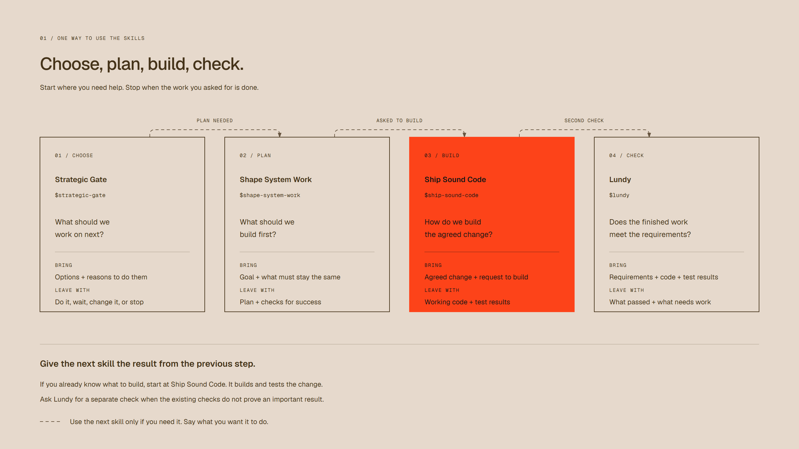

# Personal Skills

My collection of agent skills for building software, product decisions, design, and writing. Pick what you need.

[Setup](#setup) · [Choose a skill](#choose-a-skill) · [Review roles](#review-roles) · [Planning](#planning) · [Build and design](#build-and-design) · [Writing](#writing)

## Setup

### Install

```sh
npx skills@latest add takoonit/personal-skills
```

### Update

```sh
npx skills@latest update --project
```

### Remove

Remove a skill from Codex in the current project:

```sh
npx skills@latest remove dexter --agent codex
```

Add `--global` to remove the global copy instead.

## Choose a skill

Choose the skill for your current task. Use another if you still need help with a different question. Stop when the work you asked for is done.




Open the [HTML guide](docs/skills-workflow.html) in a browser for links to the skills and example requests.

## Review roles

Choose the check you need: can this code be removed, does the change follow the agreed rules, or do the tests prove it works?

### [Dexter](skills/dexter/SKILL.md)

Before removing code, you need to know whether anything still uses it.

Dexter finds unused code, repeated logic, and code that is harder to follow than it needs to be. His report shows what can be removed, why it is safe, and what needs to stay. He removes code when you ask him to, then checks that the remaining code still works.

> `$dexter`
>
> We moved checkout to Stripe, but src/payments still has the old provider
> and two wrapper layers. Can the legacy path go? Existing subscriptions
> must keep working. Report first.

### [Doakes](skills/doakes/SKILL.md)

A small fix can quietly change a rule nobody agreed to change.

Doakes checks the code against what you agreed to build and the rules that must stay true. His report points to any mismatch and explains what needs fixing. If he finds no mismatch, he says so.

> `$doakes`
>
> This PR was only supposed to add CSV export, but it also touches download
> permissions. The agreed rule is "workspace admins only."
> Is that still true? Don't edit.

### [Lundy](skills/lundy/SKILL.md)

The agent says it is done. You still need to know what the checks actually prove.

Lundy takes a separate look at the requirements, code, and test results. His report says what is proven, what is still uncertain, and which check is needed next.

> `$lundy`
>
> The retry fix is marked done and unit tests pass. The requirement is:
> retrying a timed-out payment must never charge twice.
> Does the current diff have enough proof to accept it? No fixes yet.

## Planning

### [Strategic Gate](skills/strategic-gate/SKILL.md)

An idea can be worth doing and still be the wrong thing to work on now.

Strategic Gate compares your options, the reasons for doing them, the effort, and what you'd have to put off. Use it when you need to choose what to work on. It recommends doing the work, waiting, changing the idea, or dropping it, and explains why.

> `$strategic-gate`
>
> I have five dev-days. CSV export takes two and blocks renewals for two
> paying customers. An onboarding rewrite takes five; signups drop off
> there, but we haven't interviewed users. What gets this week?

### [Shark Tank](skills/shark-tank/SKILL.md)

A convincing pitch doesn't tell me whether anyone will pay for it.

Shark Tank checks whether customers want the product, why they would choose it, and whether the numbers make sense. Bring an idea or evidence of demand and sales before spending more time or money. It recommends what to do next and names the assumption you most need to test.

> `$shark-tank`
>
> I'm considering a $15/month invoicing app for freelance designers.
> Five interviewees liked the idea; none has paid. They use spreadsheets now.
> I can spend two weekends on it. Is a build justified yet?

### [Shape System Work](skills/shape-system-work/SKILL.md)

"Build a first version" leaves a lot for an agent to decide on its own. Those decisions get expensive once they're buried in code.

Shape System Work helps decide what to build, how the parts fit together, and whether to build something or use an existing tool. It compares the options and makes a plan that says what to include, what to leave out, and how to check that it works.

> `$shape-system-work`
>
> We already send one-off invoices. Customers now want monthly recurring ones.
> Keep the existing database and email provider. No automatic card charges
> in v1. Where should the first release stop?

## Build and design

### [Ship Sound Code](skills/ship-sound-code/SKILL.md)

Once the direction is agreed, I want the change built and checked.

Ship Sound Code builds agreed features, fixes bugs, and improves existing code. It follows the repo's conventions, tests the changed behavior, and fixes problems caused by its changes. It reports what works and what it couldn't check.

> `$ship-sound-code`
>
> In POST /invoices, reject a due date earlier than the invoice date with
> HTTP 422. Equal dates stay valid, and existing error-response fields must
> stay unchanged. Implement this in the current repo. Don't commit.

### [Intentional Design](skills/intentional-design/SKILL.md)

A screen can look finished while leaving users guessing what to click or whether anything happened.

Intentional Design looks at the working screen and improves what users see first, what they can do, and how the screen shows progress, success, or failure. Use it to review the screen or make an agreed improvement using your existing components and style. It checks the interactions it changes.

> `$intentional-design`
>
> At /checkout, the total sits below Pay on mobile and failed payments
> erase the form. Keep our existing components and branding.
> Propose a layout and failure state before changing code.

### [Laws of UX](skills/laws-of-ux/SKILL.md)

"This feels confusing" is a useful signal. It doesn't tell us what to change yet.

Laws of UX looks at a working screen or recording to find where users may struggle and why. It recommends a change and a way to test the explanation. If there isn't enough evidence, it says so.

> `$laws-of-ux`
>
> In the attached checkout recording, a shopper taps Pay three times during
> a two-second wait with no visible response. What's the most likely
> problem here, and what would disprove that explanation?

## Writing

### [Clear Tactful Writing](skills/clear-tactful-writing/SKILL.md)

Ask an agent to polish a message and it can come back sounding like someone else. Sometimes it even adds a promise I never made.

Clear Tactful Writing rewrites emails, chats, and difficult requests in natural Thai or English. It adjusts the tone, cuts filler, and keeps the facts and commitments intact. You get a draft ready to use.

> `$clear-tactful-writing`
>
> Write a Thai LINE message to a client: the extra dashboard is outside
> our agreed scope. I can quote it separately, but Friday's delivery covers
> only the original work. Friendly and firm, under four sentences.

---

Diagrams made with Diagram Design using [Optikka](https://optikka.com/) as a reference. The [design notes](docs/skills-guide-design.md) list the colors and replacement fonts.

[Contributing](CONTRIBUTING.md) · [Evaluation](docs/evaluation.md)
